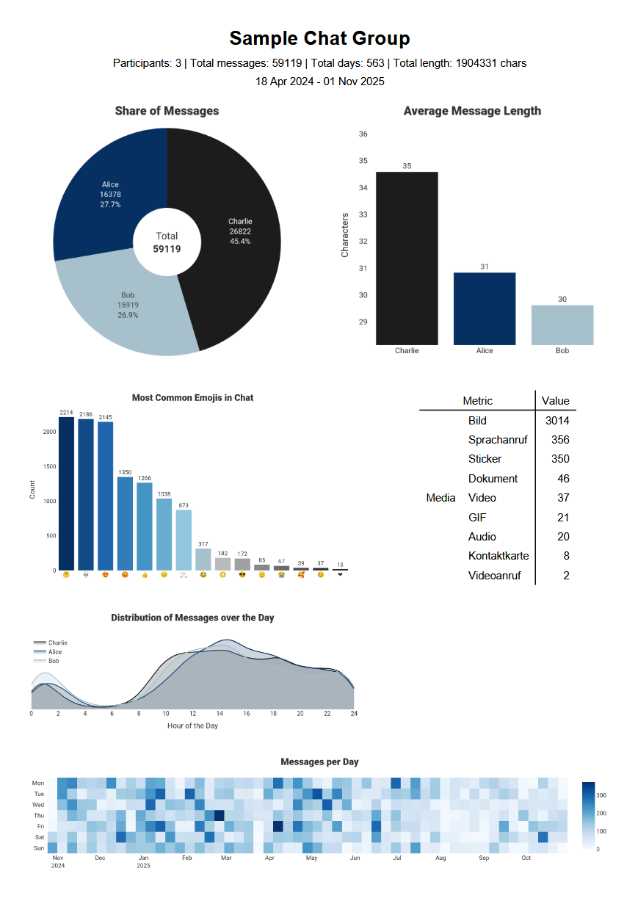

# whatsapp-chat-analyzer
Tool to get insights into a whatsapp chat.

[](./showcase.png)

## Usage
1. Clone the repository and install the required dependencies.
   ```bash
   git clone https://github.com/yourusername/whatsapp-chat-analyzer.git
   cd whatsapp-chat-analyzer
   pip install -r requirements.txt
   ```
2. Run the report generator with the path to your WhatsApp chat export file.
   ```bash
   python report.py --file path/to/whatsapp_chat.txt
   ```

Note: Since some visualizations require plotly you may need to install a chrome instance using:
```bash
plotly_get_chrome
```
Note: You might need to install 
```bash 
sudo apt install libcairo2-dev pkg-config python3-dev
```

## Disclaimer
This tool is intended for **personal use only** to analyze your own WhatsApp chat exports for statistical insights and visualization purposes. It operates entirely on self-exported, local files that you provide and does not transmit, store or share any data to external servers or third parties.

- Only use this tool on chat data that you have legally obtained and have the right to process.
- Respect the privacy of all individuals in the chat conversations.
- You are solely responsible for ensuring compliance with applicable data protection laws (e.g., GDPR, privacy regulations) in your jurisdiction.
- The authors of this tool are not liable for any misuse, data breaches, or legal consequences arising from the use of this software.
- Do not share generated reports or analysis results without the explicit consent of all chat participants.

By using this tool, you acknowledge that you understand and accept full responsibility for your use of it.